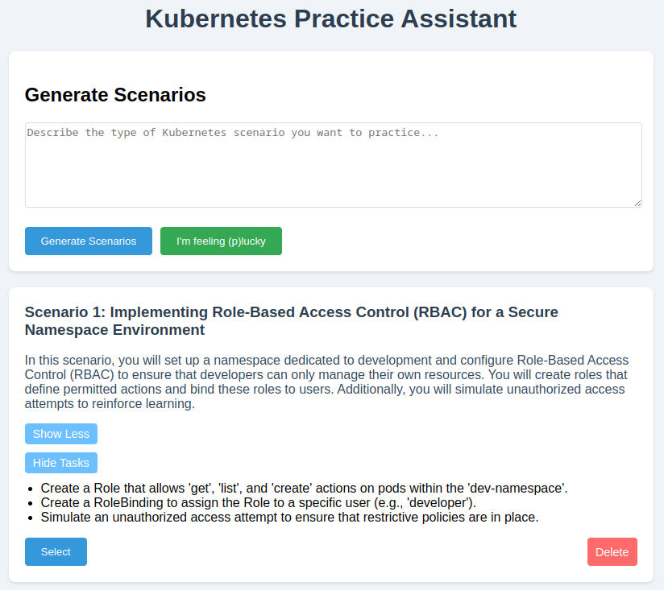

# Kubernetes Practice Assistant (KPA)

The Kubernetes Practice Assistant (KPA) is a simple tool designed to help you prepare for Kubernetes certifications and improve your practical skills. 

Key features:
- Interactive practice environment for Kubernetes
- AI-powered assistant to guide your learning
- Flexible scenarios to test various skill levels
- Open-ended practice sessions to fit your schedule

Whether you're studying for a certification or just want to sharpen your Kubernetes skills, KPA provides a hands-on, adaptable practice experience.

## Why KPA?

Kubernetes certifications are heavily focused on practical skills, and the best way to learn Kubernetes is by doing. KPA was created with this principle in mind, offering a sandbox environment where you can experiment, make mistakes, and learn from hands-on experience. By combining real Kubernetes interactions with AI-guided assistance, KPA aims to bridge the gap between theory and practice, helping you build the confidence and skills needed for both certifications and real-world Kubernetes management.

# Development Roadmap

The KPA project is currently in the early stages of development. The following features are planned for future releases:
- [x] Have GPT4o mini create a few scenarios to choose from based on a simple initial prompt
- [x] Store scenarios in a sqlite database
- [x] Add terminal to scenario page and have it connect to backend via ws
- [ ] Simple interface with the chosen scenario created on the left and a chat window on the right
    - [ ] The left pane will house the task description as well as a "Check" button
- [ ] Ability to have GPT4o mini provide hints and guidance based on user input
- [ ] Agent flow to check if the user has completed the scenario
- [ ] Helm chart to deploy the KPA application on a Kubernetes cluster

# License

This project is licensed under the MIT License - see the [LICENSE](LICENSE) file for details.